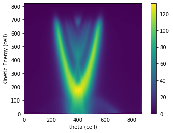
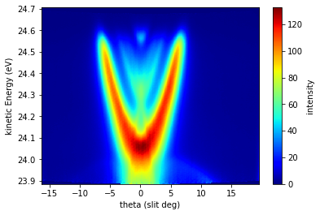
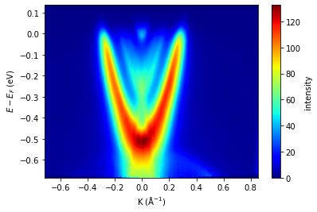

# EDA

###### 다음은 ARPES 실험 데이터를 가져와 분석해는 코드입니다.


# 모듈 가져오기


```python
import matplotlib.pyplot as plt
import numpy as np
import pandas as pd
from scipy.interpolate import interp2d
```

# CSV 파일 읽고 전치


```python
data = np.genfromtxt('Cut280K_rNx.csv', delimiter=',')
matrix = np.transpose(data)
matrix.shape
```


    (821, 876)


# 로우데이터 시각화


```python
matrix = np.transpose(data)
plt.imshow(matrix,origin='lower')
plt.xlabel('theta (cell)')
plt.ylabel('Kinetic Energy (cell)')
plt.colorbar() #옆에 컬러바
```


    <matplotlib.colorbar.Colorbar at 0x7fece9428b50>


    

    


# 상수 정의


```python
h = 6.626e-34 # Planck constant (m^2 kg/s)
hbar = h/(2*(np.pi)) # Dirac's constant
m = 9.109e-31 # electron mass (kg)
hv = 29 # 빛의 에너지  (eV)
wf = 4.43 # 일함수 (eV)
```

# matrix 행(x축), 열(y축) 정보


```python
delta_ke = 0.001 # kinetic Energy(eV)의 delta값
start_ke = 23.885 #kinetic Energy(eV)의 시작값
ke_unit = 'eV'
kinetic_energy = np.linspace(start_ke, start_ke + delta_ke * matrix.shape[0], matrix.shape[0])

delta_theta = 0.041096 # 각도(Θ)의 delta값
start_theta = -16.3795 # 각도(Θ)의 시작값
theta_unit = 'slit deg'
theta = np.linspace(start_theta, start_theta + delta_theta * matrix.shape[1], matrix.shape[1])
```

# kinetic_energy와 theta 그래프 그리기


```python
fig, ax = plt.subplots()
im = ax.imshow(matrix, extent=[theta.min(), theta.max(), kinetic_energy.min(), kinetic_energy.max()], aspect='auto', cmap='jet',origin='lower',interpolation='nearest')
ax.set_xlabel('theta ({0})'.format(theta_unit))
ax.set_ylabel('kinetic Energy ({0})'.format(ke_unit))
cbar = fig.colorbar(im)
cbar.set_label('intensity')
```


    

    


# Binding Energy(eV) 계산


```python
binding_energy = hv - wf - kinetic_energy
binding_energy = (-1)*binding_energy
# − E_B , E − E_F를 축으로 사용한다.
```

# K 계산


```python
#단위 변환
kinetic_energy_J = kinetic_energy * 1.602176634e-19
```


```python
theta = np.linspace(start_theta, start_theta + delta_theta * matrix.shape[1], matrix.shape[1])
K_first = np.sqrt(2*m*max(kinetic_energy_J)) * np.sin(np.deg2rad(start_theta)) / hbar
K_last = np.sqrt(2*m*max(kinetic_energy_J)) * np.sin(np.deg2rad(max(theta))) / hbar
K = np.linspace(K_first, K_last, theta.size)
K=K*(10**(-10))
```


```python
# 2차원 보간 함수 생성
interp_func = interp2d(K, binding_energy, matrix, kind='linear') # kind = 'linear': 선형 보간, 'cubic': 3차 스플라인 보간, 'quintic': 5차 스플라인 보간

# 2차원 보간 함수를 이용하여 보간된 새로운 행렬 생성
interp_EB_K_matrix = interp_func(K, binding_energy)
```

# binding_energy와 K 그래프 그리기


```python
# 시각화
fig, ax = plt.subplots()
im = ax.imshow(interp_EB_K_matrix , aspect='auto',cmap='jet',origin='lower',extent=[K[0],K[-1] , binding_energy[0], binding_energy[-1]])
ax.set_xlabel('K (Å$^{-1}$)')
ax.set_ylabel(' $E-E_F$ ({0})'.format(ke_unit))
cbar =fig.colorbar(im)
cbar.set_label('intensity')
```


    

    


```python
# CSV 파일로 저장
# kinetic_energy와 theta 그래프 CSV 파일로 저장
df = pd.DataFrame(matrix, columns=theta, index=kinetic_energy)
df.columns.name = 'theta ({0})'
df.index.name = 'Kinetic Energy ({0})'.format(ke_unit)
df.to_csv('Ek_theta_matrix.csv')
# binding_energy와 K 그래프 CSV 파일로 저장
df = pd.DataFrame(interp_EB_K_matrix , columns=K, index=binding_energy)
df.columns.name = 'K (Å$^{-1}$)'
df.index.name = '$E-E_F$ ({0})'.format(ke_unit)
df.to_csv('interp_Eb_K_matrix.csv')
```


```python

```


```python

```


```python

```


```python

```
