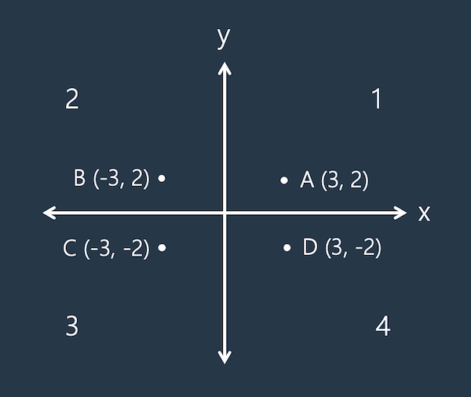

<br>

## 리눅스 vi editor 모드와 명령어

리눅스 운영체제에서 텍스트 편집 작업은 핵심적인 기능 중 하나입니다. 이를 위해 사용되는 편집기 중 하나가 바로 vi editor입니다. 이 글에서는 vi editor의 기본적인 사용 방법과 특징을 살펴보겠습니다.

## 1. 기본 모드 (Normal Mode):

vi editor는 총 4개의 모드로 구성되어 있습니다.

Normal 모드: 기본 모드로, 명령어를 입력하고 편집을 수행하는 모드입니다.

## 2. Insert 모드:
Insert 모드로 들어가려면 `i` 키를 누릅니다.

`a` 키를 누르면 현재 커서 다음에 입력이 가능하고, `A` 키를 누르면 현재 라인의 끝에 입력이 가능합니다.

Insert 모드에서 나가려면 `ESC` 키를 누릅니다.

## 3. Command 모드:

Command 모드로 들어가려면 `:`(콜론)을 입력합니다.

Command 모드에서는 리눅스 명령어를 실행할 수 있습니다.
Command 모드에서 나가려면 `ESC` 키를 누릅니다.
## 4. Visual 모드:
Visual 모드로 들어가려면 `V`를 누릅니다.

Visual 모드에서는 텍스트를 선택하고 편집할 수 있습니다.
Visual 모드에서 나가려면 `ESC` 키를 누릅니다.

## vi editor의 사용법:

`:` 키를 눌러 Command 모드로 들어간 후에 다양한 리눅스 명령어를 사용할 수 있습니다.


## vi editor 명령어 순서

vi editor를 어렵게 느끼는 이유 중 하나는 
```bash
[count] + [operator] + [motion]
```
형태의 명령어 구조를 사용하기 때문입니다.

예를 들어, '10번 반복해라 + 라인을 지워라 + 밑에 줄까지'와 같은 구조로 작동합니다.

참고로 숫자를 입력하지 않으면 기본적으로 1로 작동합니다.

<br>

---
<br>


## vi Editor 명령어들




```bash
a: 커서 뒤에 텍스트 추가 (Append)
```
```bash
A: 현재 라인의 끝에 텍스트 추가
```
```bash
dd: 한 줄 삭제
```
```bash
yy: 한 줄 복사
```
```bash
p: 복사한 텍스트 붙여넣기
[count] + p: 특정 횟수만큼 텍스트 붙여넣기
```
```bash
x: 커서 위치의 한 글자 삭제
```
```bash
dw: 한 단어 삭제
[count] + dw: 특정 횟수만큼 단어 삭제
```
```bash
d $: 현재 위치에서 라인 끝까지 삭제
```
```bash
P: 커서 위치 앞에 텍스트 붙여넣기
```
```bash
/1234: "1234" 문자열을 찾기
```
```bash
n: 다음 "1234"로 이동
```
```bash
N: 이전 "1234"로 이동
```
```bash
4dd: 4줄 삭제
```
```bash
o: 다음 줄에 텍스트 삽입
```


특정 문자열 대체:

```bash
:%s/1234/9999/g: 문서 전체에서 "1234"를 "9999"로 대체
```

블록 선택:
```bash
Ctrl + v: 블록 모드 활성화 (화살표 키로 블록 선택)
c: 선택한 블록에 대한 명령 수행
```
```bash
Ctrl + a: 커서 위치의 숫자를 1 증가
Ctrl + x: 커서 위치의 숫자를 1 감소
```

기타 명령어:
```bash
Ctrl + z: vi editor를 일시 중단 (background로 보냄)
fg: 중단된 vi editor로 다시 돌아감
:w <파일명>: 편집 내용을 <파일명>으로 저장
:w: 현재 파일에 저장
:w <새로운파일명>: 새로운 파일로 저장
:wq: 저장하고 vi editor 종료
:q!: 저장하지 않고 강제로 vi editor 종료
```

`%` 키를 사용하여 쌍을 찾아갈 수 있으며, 예를들어 'd%' 명령어를 사용하면 해당 쌍까지 삭제할 수 있습니다.
