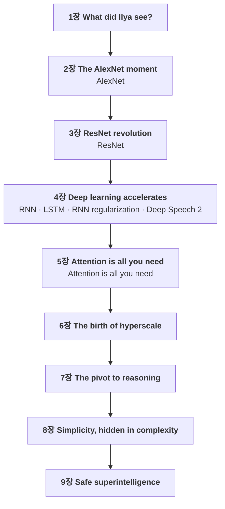

## 책의 구성

Sutskever's List는 9개 장으로 구성된다. 각 장 아래에는 이 시리즈에서 정리한 글을 적었다.

```mermaid
%%{init: {"flowchart": {"wrappingWidth": 400}}}%%
flowchart TD
    C1["<b>1장 What did Ilya see?</b>"] --> C2["<b>2장 The AlexNet moment</b><br>AlexNet"]
    C2 --> C3["<b>3장 ResNet revolution</b><br>ResNet"]
    C3 --> C4["<b>4장 Deep learning accelerates</b><br>RNN · LSTM · RNN regularization · Deep Speech 2"]
    C4 --> C5["<b>5장 Attention is all you need</b><br>Attention is all you need"]
    C5 --> C6["<b>6장 The birth of hyperscale</b>"]
    C6 --> C7["<b>7장 The pivot to reasoning</b>"]
    C7 --> C8["<b>8장 Simplicity, hidden in complexity</b>"]
    C8 --> C9["<b>9장 Safe superintelligence</b>"]
```

출처: Richard Heimann, *Sutskever's List* (Manning) 목차

